# SGI 2022/2023 - TP1

## Group T04G06 - Gym

| Name             | Number    | E-Mail               |
| ---------------- | --------- | -------------------- |
| Margarida Vieira | 201907907 | up201907907@fe.up.pt |
| Tiago Silva      | 201906045 | up201906045@fe.up.pt |

---

## Project Information

The [original.xml](scenes/original.xml) scene consists of:

- three posters representing what we like to call "Wall of Fame"
- an olympic barbell with two plates and the correspondent rack
- a plates rack with multiple plates, those with different weights
- three wall balls of different sizes
- two dumbbells with the same weight
- two comfortable yoga mattresses
- a bench
- a box
- a boxe bag
- a digital wall clock

---

## Extras

In addition to what was initially proposed, we decided to implement a few extra features that we consider worth mentioning:

1. Since the materials changed by clicking the key `M`, we thought it would be interesting to allow the textures to change as well by clicking the key `T`. To allow so, we created another tag, `<textures>`, which, in place of the existent one, `<texture>` would indicate the presence of multiple textures, hence of multiple `<texture>` tags inside.
2. In addition to the standard controls, we decided to also include the light attenuation control in the interface.
3. As the majority of our textures had _length_t_ and _length_s_ equal to 1.0, we reasoned that it would make sense to have a default value for these attributes, permitting their omission. We opted to explicitly declare those values in the scenes, nevertheless.
4. We handle cycles, forbidding them, in components referencing.

**IMPORTANT**: The point 1 forced us to create another _.xml_ file - [multiple-textures-allowed](scenes/multiple-textures-allowed.xml), so that the original one would remain compatible with all parsers.

---

## Issues/Problems

We did have one bug that took us a bit longer to figure out, related to the multiple textures. Let's suppose we had the components A1, A2 and A3 and they both had component A as a child. The multiple textures were applied to the component A. When clicking `T` to change to the next texture, what was happening was that it was changing a number of times equal to the number of components who had A as a child because of the nodes traversing. Nonetheless, we fixed that bug, and not many more difficulties were encountered.

---

## Screenshots

### Different Cameras

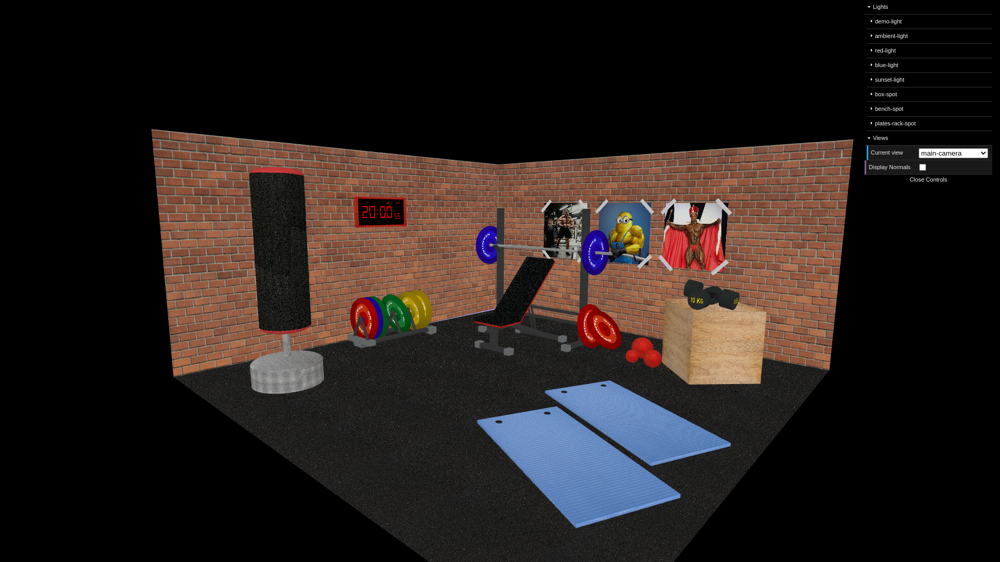
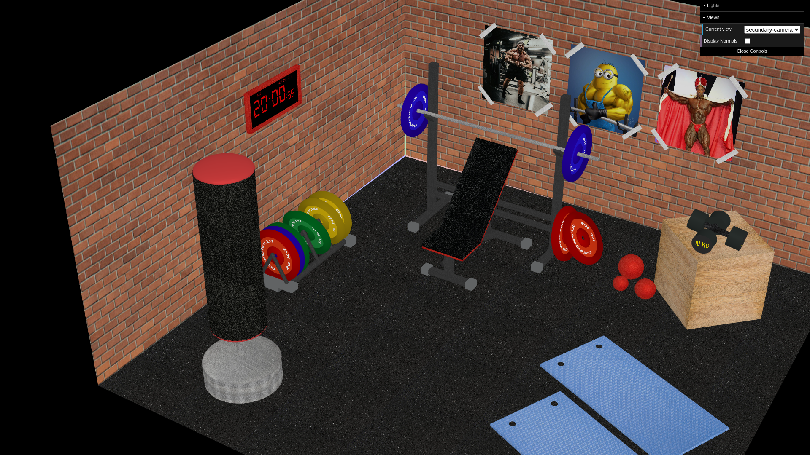
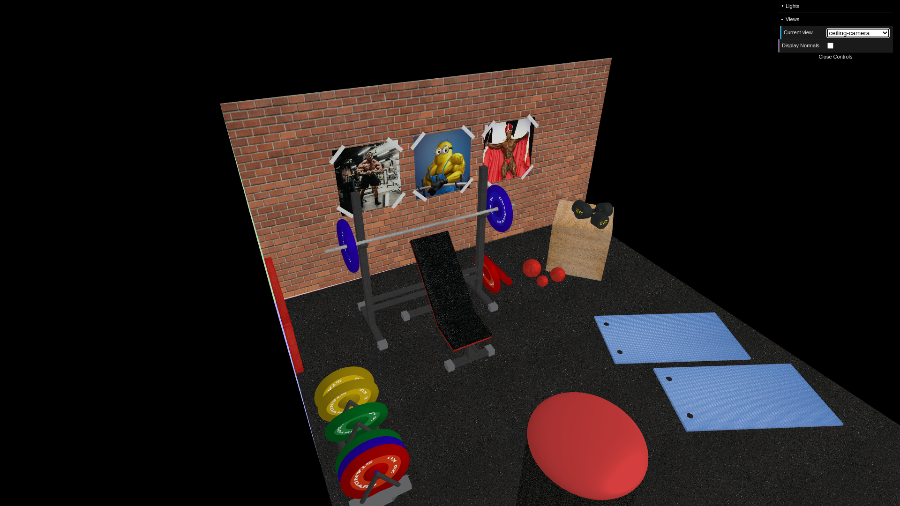
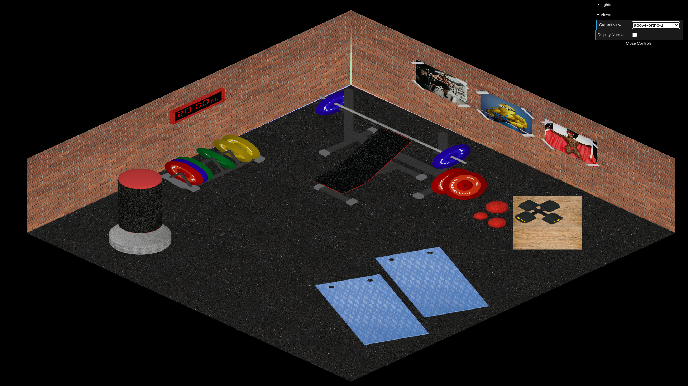
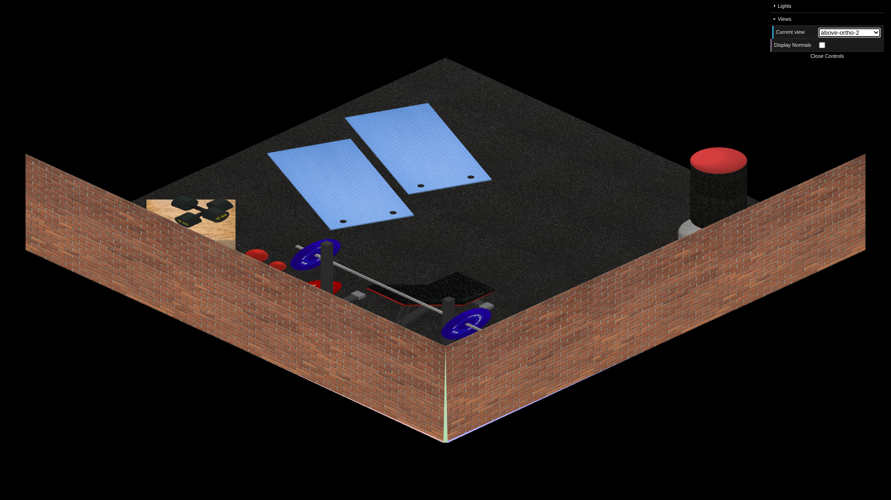
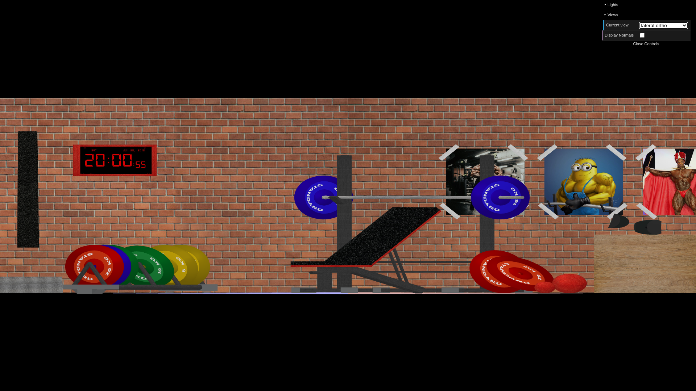

### Different Lights

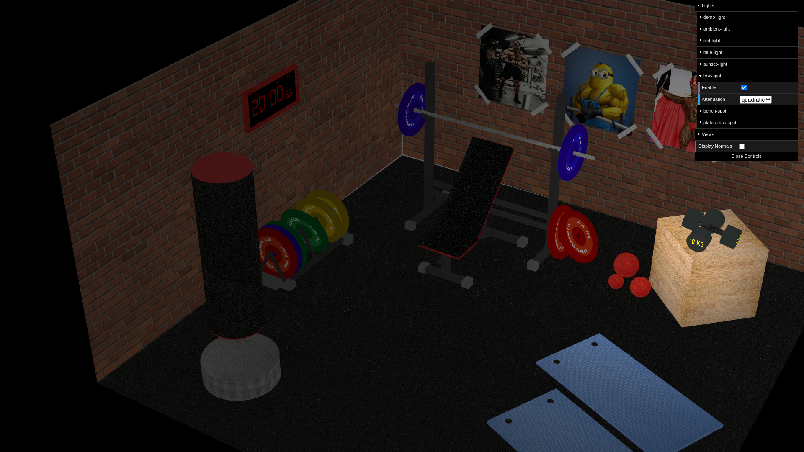
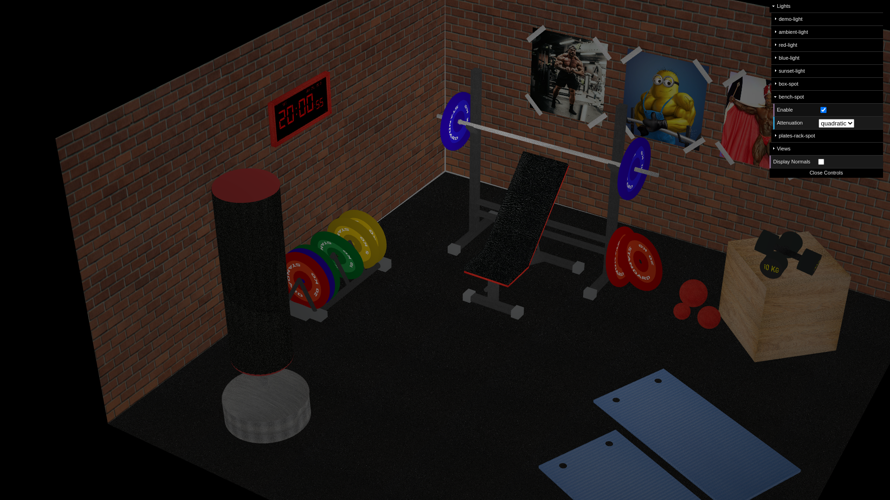
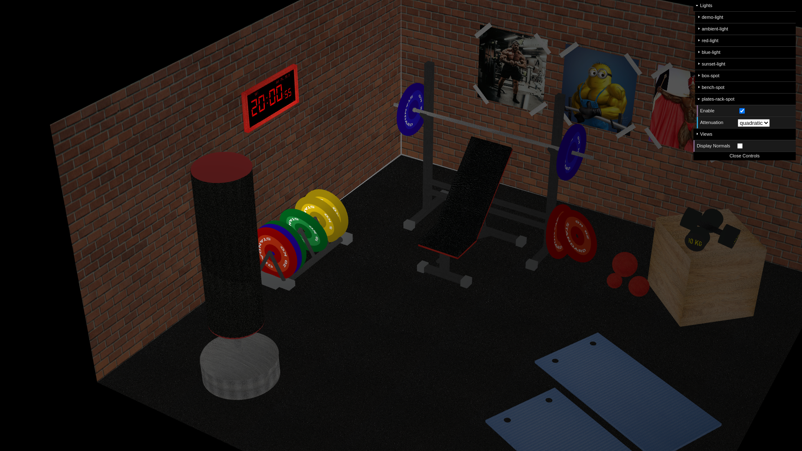
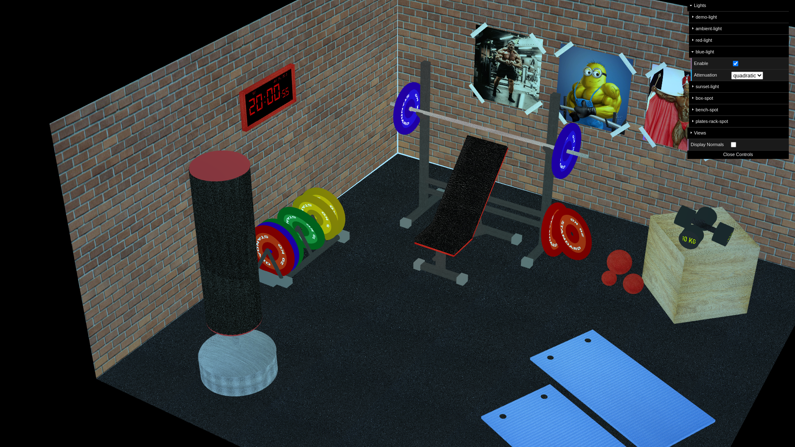
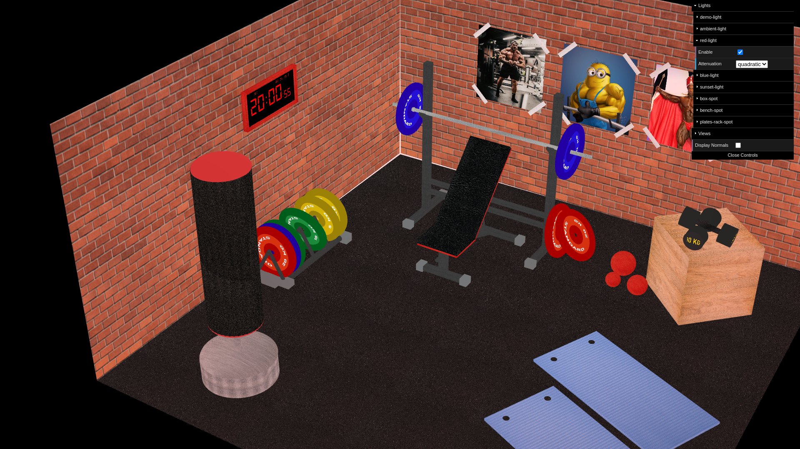

### Different Textures

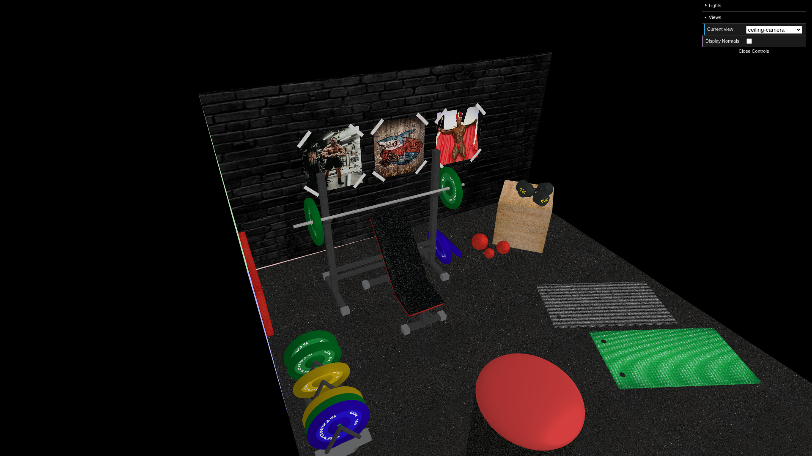
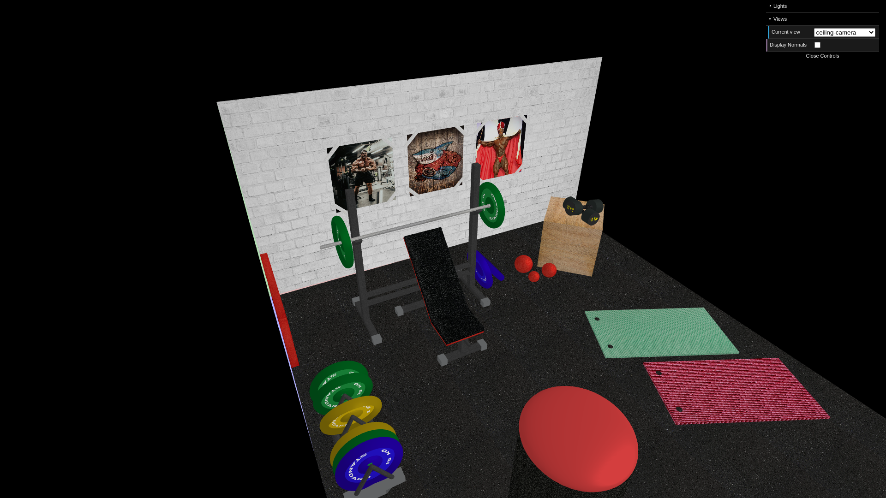
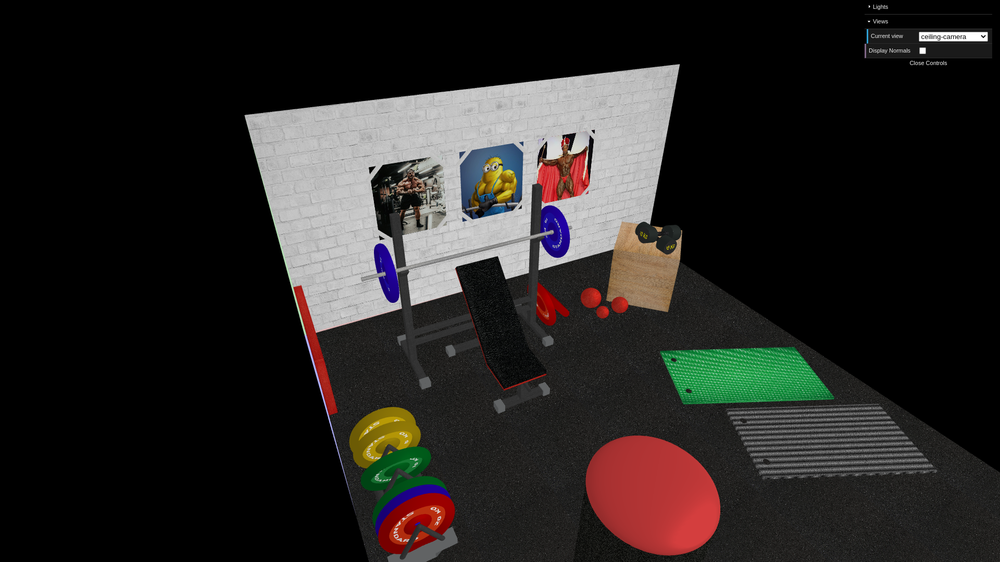

