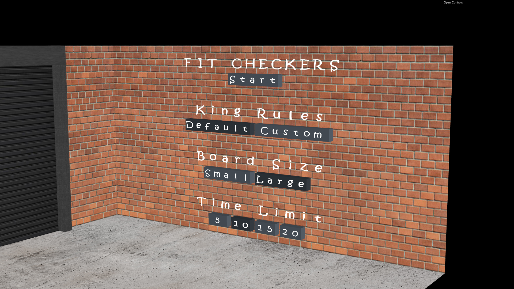

# SGI 2022/2023 - TP3

## Group T04G06 - Gym

| Name             | Number    | E-Mail               |
| ---------------- | --------- | -------------------- |
| Margarida Vieira | 201907907 | up201907907@fe.up.pt |
| Tiago Silva      | 201906045 | up201906045@fe.up.pt |

---

## Project information

This delivery focused on the development of a checkers game ambient, which includes a board and respective pieces, two supports to stack the captured pieces and a timer showing, for each player, the remaining time and wins, stored in the local storage at the end of a game.

|                Menu                |
| :--------------------------------: |
|  |

The entry point to the game is the menu, where the user is presented with a set of options for configuring the game as he wishes, those being:

- two board sizes:
  - large: a giant board is loaded in the room next to the gym room
  - small: a smaller board is loaded in the gym room, between the two mats, to simulate that the players are seated on them
- two options for the king rule:
  - default: the king can move one cell in any direction
  - custom: the king can move any number of cells in any direction
- four options for the time limit of each player which, in the end, translate into different levels of difficulty:
  - 5 minutes
  - 10 minutes
  - 15 minutes
  - 20 minutes

|                Small Board                |                Large Board                |
| :---------------------------------------: | :---------------------------------------: |
|  |  |

|        Default King Rule Exemplification        |        Custom King Rule Exemplification        |
| :---------------------------------------------: | :--------------------------------------------: |
|  |  |

|                Timer                |
| :---------------------------------: |
|  |

The menu was implemented using the spritesheets technique and supports two font colors - black and white (default), and two font weights - bold and regular (default).

Whilst on the menu, the user can view the previous game’s movie, if there is one, by pressing `F`. During the movie, the timer is disabled and it shows a time limit of 00:00 for both players.

The Start button redirects the user to the game.

To perform a move, the user must select a piece and its destionation cell. By default, a piece selection is only allowed if it corresponds to one of the turn player’s pieces, and, whenever an invalid piece is selected, it undergoes an animation simulating a slight vibration. It should be noted that, in order to maximize efficiency, the valid moves for each piece are precalculated at the start of the game so they don't need to be computed each time a move is made.

In the case where it is possible for that turn's player to effect a capture of one (or more) of his opponent’s pieces, only the piece(s) and corresponding destination cell(s) leading to that capture will be considered valid.

Upon selecting a piece, the possible movements are highlighted for the user to select the destination cell - a yellow highlight represents a normal move, and a green highlight represents a capture move.

|                Normal Move Highlight                |                Capture Move Highlight                |
| :-------------------------------------------------: | :--------------------------------------------------: |
|  |  |

When the user selects the destination cell, the piece starts its movement. In the case of a capture move, the player’s selected piece collides with the opponent’s soon-to-be-captured piece, and the latter is transported to and stacked in the corresponding support, following a bezier curve. When the opponent’s captured piece is no longer blocking the path, the player’s piece continues the movement to the selected destination.

|             Capture Move              |
| :-----------------------------------: |
|  |

Lastly, when the piece reaches the opposite side of the board, it upgrades to a king piece, becoming three simple pieces stacked on top of each other. Regarding the king pieces, there are several animations to consider:

- the transition from simple to king piece;
- when a king piece is captured, it also changes into a simple piece as it moves towards the corresponding support, taking up less room in it;
- when a king piece returns to the board, which can happen if the player undoes a move which had resulted in the capture of a king piece and its consequent move to the support, it reappears on the board as a simple piece and then transforms into a king piece, following the first animation described above.

|       From Simple to King Piece Animation       |
| :---------------------------------------------: |
|  |

Additionally, every time a user selects a piece and during the whole animation from its original cell to its destination cell, the piece is tracked by a spotlight, whose cutoff angle will have the span of one cell, considering the light's perpendicular distance to the cell and the cell size.

An animation's execution constitutes a game state by itself, and hence all pickings are disabled while it is taking place.

The player can always press `Z` to undo moves up until the game’s start, at which point there are no moves remaining to undo, or `Q` to quit the game.

Regarding the undo of a move, whenever a move occurs, the result of its execution is stored in a stack-like structure, so the undo operation can be performed by popping the last element of the stack and reversing the move.

In the interface, the user can enable/disable the camera animations in the Camera Animations checkbox, and change their duration in the Camera Animations Duration slider input. During the game, the camera will switch between pre-defined cameras depending on the current state. However, the current camera can also be changed via the interface, by selecting any of the available in the Views drop-down. Note that, if camera animations are enabled, changing the camera via interface will also trigger an animation, unless an ortho camera is involved.

|           Interface Controlls           |
| :-------------------------------------: |
|  |

On top of the entire game logic described above, we also implemented an animation called `MyPickableAnimation`. This essentially represents an animation that is triggered on the component that has it (component that has the `animation` tag), by picking the component that controls it (component that has the `controlledanim` tag). This can be observed by clicking on the red button next to the garage door, which will cause it to open/close.

|  MyPickableAnimation - Garage Door Exemplification  |
| :-------------------------------------------------: |
|  |

|                 Controlled Component                 |                   Controller Component                    |
| :--------------------------------------------------: | :-------------------------------------------------------: |
|  |  |
